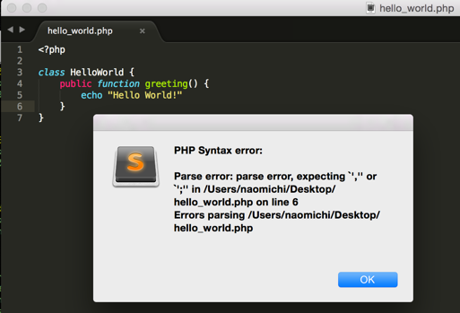

Bash Syntax Checker
==================
This package is plugins for Sublime Text 2 and 3.
When you save Shell Script file, perform syntax check of Bash using `bash -n`.

Inspired by [PHPSyntaxChecker](https://github.com/naomichi-y/php_syntax_checker) Writen by  Naomichi Yamakita - n.yamakita@gmail.com

Usage notes
-----------
Only have to save php file.
If contains an error, a warning dialog will appear.

Licence
-------
MIT Licence:
 * http://opensource.org/licenses/MIT

Contacts
--------
Writen by:
 * Napoleon Arouldas S. - meetneps@gmail.com
